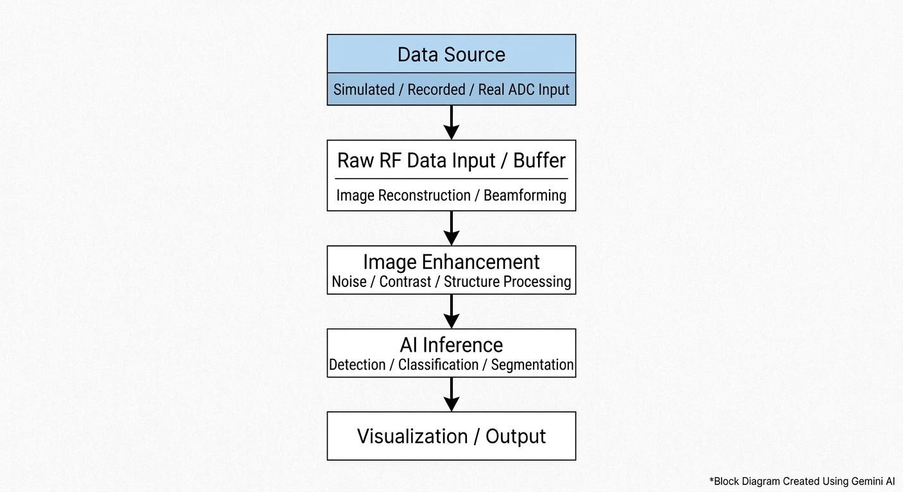
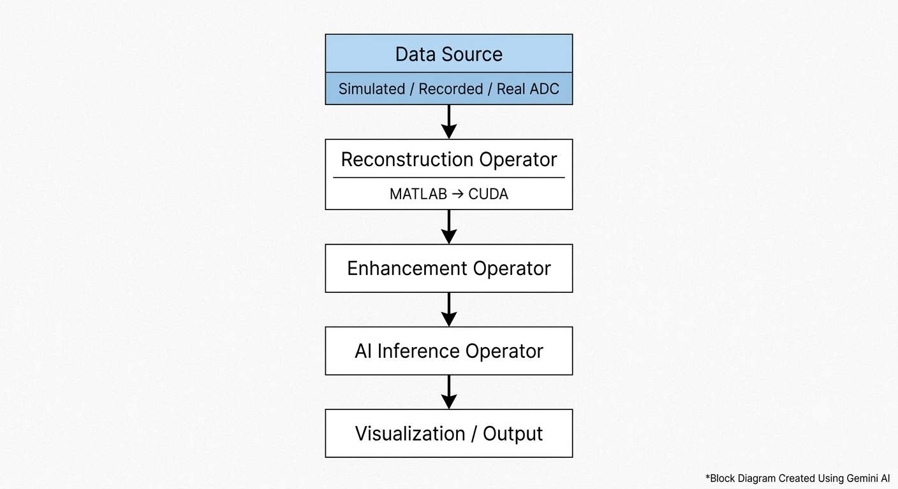

# System Overview

## 1. Project Vision

The purpose of this project is to explore how a medical imaging system can move from raw sensor data to useful medical information in real time.

For this project, I am using ultrasound imaging as the main application because ultrasound gives us a good example of a system where a large amount of raw signal data has to be processed quickly before a meaningful image can be produced.

The system will not start with an already-formed image. Instead, the intention is to begin as close to the acquisition side as possible. The input will represent the raw digital data that could come from an ultrasound acquisition system after the received analog signals have been sampled by a high-speed Analog-to-Digital Converter (ADC).

From there, the data will go through several stages. The raw ultrasound data will first be processed to reconstruct an image. That image will then be enhanced so that useful structures are easier to observe. After enhancement, an AI-based processing stage will be introduced to extract higher-level information from the image.

The interesting part of the project is that these stages should eventually operate as one continuous real-time pipeline rather than as isolated demonstrations.

The initial development will therefore focus on understanding and validating each processing stage independently. Once the individual stages are reliable, they will be connected together and optimized for GPU execution. MATLAB will be used during the algorithm-development and validation stages, while MATLAB GPU Coder will be investigated for generating CUDA-based implementations of the computationally intensive processing.

The final deployment target is NVIDIA Holoscan. Holoscan will provide the streaming framework required to connect the different processing stages and operate on incoming data as a real-time application.

Analog Devices, Inc. (ADI) is the industry partner for this project, so the intended system also considers the hardware side of medical imaging acquisition. If suitable ADI high-speed ADC hardware is available, it can eventually be incorporated into the acquisition portion of the system. If hardware access is not practical, simulated or pre-recorded data will be used while maintaining the same conceptual acquisition-to-processing workflow.

The overall vision is therefore not simply to create an ultrasound image or train an AI model. The goal is to understand and demonstrate the complete engineering pipeline that connects sensing, signal processing, image formation, image enhancement, AI inference, GPU acceleration, and real-time deployment.

At the end of the project, the system should provide a clear demonstration of how raw medical imaging data can be transformed into an enhanced and AI-interpreted result while maintaining the requirements of a real-time processing pipeline.

## 2. System Objective

The main objective of this project is to design and develop a complete real-time medical imaging pipeline that can take raw ultrasound data as its input and produce an enhanced, AI-interpreted medical image as its output.

The system is intended to represent the processing chain of a practical ultrasound imaging device rather than focusing on only one individual algorithm. The objective is therefore to connect the different stages of the system in a meaningful way and understand how data moves through the complete pipeline.

At the input side, the system will accept ultrasound RF data representing the output of a high-speed data acquisition stage. In a real implementation, this data could originate from an Analog Devices high-speed ADC connected to an ultrasound transducer or an equivalent acquisition system. Since access to physical acquisition hardware may be limited, the initial implementation will use simulated or pre-recorded datasets that reproduce the characteristics of the required digital input.

The first objective after acquiring the data is to reconstruct a useful ultrasound image from the raw RF signals. This stage will involve understanding the relationship between the received signals and the spatial information contained within them. Appropriate beamforming and signal-processing techniques will be investigated to transform the raw channel data into a two-dimensional image representation.

Once the image has been reconstructed, the next objective is to improve its quality through image processing. Ultrasound images commonly contain speckle and other forms of noise, and the visibility of relevant structures can depend heavily on the processing applied after reconstruction. The project will therefore investigate suitable enhancement techniques while considering both image quality and computational complexity.

The following objective is to introduce an AI-based interpretation stage. A lightweight AI model will be used to perform a defined task such as detecting a region of interest, classifying an image, or identifying a particular structure or pattern. The AI component will be selected and developed with the real-time requirement in mind, since a model that performs well but requires excessive computation would not be suitable for the intended deployment.

Another major objective is to investigate GPU acceleration of the computationally intensive portions of the pipeline. Once the algorithms have been developed and validated, MATLAB GPU Coder will be used to explore the generation of CUDA code suitable for execution on NVIDIA GPU hardware. The purpose of this stage is to move beyond a desktop-oriented algorithm implementation and toward an implementation capable of supporting continuous real-time processing.

The final software objective is to integrate these accelerated components into an NVIDIA Holoscan application. The resulting system should represent the processing stages as a streaming pipeline in which data enters the system, passes through reconstruction and enhancement, reaches the AI inference stage, and is finally sent to a visualization or output stage.

An important objective throughout the project is to maintain a clear separation between algorithm correctness and system performance. Each stage will first be validated to ensure that it produces the expected result. Performance optimization will then be performed based on actual measurements such as execution time, frame latency, and processing throughput.

The project will also evaluate how the choice of algorithms affects the overall system. A method that produces excellent image quality may not necessarily be the best choice if it introduces too much computational latency. Similarly, a highly accurate AI model may not be appropriate if its inference time prevents the complete pipeline from operating at the required rate.

Therefore, the system objective is ultimately a balance between **image quality, AI performance, computational efficiency, and real-time behavior**.

The final implementation should demonstrate the following complete workflow:

**Raw Ultrasound Data → Image Reconstruction → Image Enhancement → AI Inference → GPU-Accelerated Processing → Holoscan Streaming → Visualization**

The exact algorithms, datasets, AI model, hardware configuration, and performance targets will be established progressively during development. This allows the system objective to remain practical while still preserving the overall goal of building a complete acquisition-to-interpretation real-time medical imaging pipeline.

## 3. System Scope

The scope of this project covers the complete software processing chain required to demonstrate real-time ultrasound image formation and interpretation, beginning with raw digital sensor data and ending with a visualized AI-assisted result.

The project will primarily focus on ultrasound imaging. Ultrasound is suitable for this work because the imaging process naturally connects signal acquisition, raw RF data processing, beamforming, image reconstruction, image enhancement, and AI-based interpretation. This also allows the project to demonstrate how a system can move from low-level sensor data to higher-level information without assuming that an image already exists at the input.

The input side of the system will represent the output of a high-speed data acquisition system. The preferred scenario is to work with data originating from an Analog Devices high-speed ADC. However, physical ADC hardware is not considered a mandatory dependency for the initial implementation. Pre-recorded or simulated RF datasets will be used where necessary so that development can continue without being limited by hardware availability.

The signal-processing portion of the project will cover the transformation of raw ultrasound data into a two-dimensional image. This includes investigating the characteristics of the input data, understanding the required acquisition parameters, applying the necessary signal processing, and implementing an appropriate beamforming or image-reconstruction approach.

The image-processing portion will focus on improving the reconstructed image before it is passed to the AI stage. Techniques such as speckle reduction, contrast enhancement, and edge-preserving processing may be investigated. The final enhancement method will be selected based on its usefulness to the overall system rather than simply its visual appearance.

The AI portion of the project will be limited to a practical demonstration of medical-image interpretation. The initial implementation will use a lightweight model capable of performing a clearly defined task such as classification, detection, or segmentation. The model will be evaluated as part of the complete pipeline, meaning that inference speed and deployment requirements will be considered alongside prediction performance.

GPU acceleration is also within the scope of the project. MATLAB will be used for algorithm development and validation, while MATLAB GPU Coder will be investigated for generating CUDA implementations of suitable processing stages. The intention is to identify the portions of the pipeline where GPU acceleration provides meaningful benefits and integrate those implementations into the final deployment.

NVIDIA Holoscan will form the basis of the final real-time application architecture. The system will be organized around streaming data and processing operators rather than relying only on a sequential offline MATLAB workflow. The Holoscan application will ultimately connect the input source, accelerated processing stages, AI inference, and visualization or output.

Performance evaluation is also part of the project scope. The final system will be measured using quantities such as processing time, frame latency, throughput, and AI inference time. Image quality will also be compared before and after enhancement so that the effect of the processing stages can be demonstrated.

The project will not initially attempt to create a clinically certified medical device or a diagnostic system suitable for use with real patients. The AI results will be treated as an engineering demonstration of medical-image interpretation rather than as a replacement for professional medical diagnosis.

Similarly, real Analog Devices hardware integration will be treated as an extension of the core system when hardware access is available. The primary architecture will remain capable of operating with simulated or recorded input so that the complete processing and deployment workflow can be developed independently of physical hardware.

Advanced features such as real ADC integration, advanced segmentation, temporal motion analysis, multiple AI models, transformer-based inference, or support for additional imaging modalities may be considered after the core pipeline is functioning reliably.

The scope will therefore remain centered around one main objective: **building and demonstrating a complete, measurable, GPU-accelerated, real-time ultrasound imaging pipeline from raw data to AI-assisted output.**

## 4. System Architecture

The system will be developed as a sequence of connected processing stages, with each stage having a clearly defined responsibility. The architecture is intentionally being kept modular so that individual components can be developed and validated independently before they are combined into the final real-time application.

At a high level, the system will follow this path:

**Data Source → Raw RF Data → Image Reconstruction → Image Enhancement → AI Inference → Visualization / Output**

The data source represents the acquisition side of the system. In the intended hardware configuration, this would correspond to ultrasound signals being acquired and digitized using a high-speed Analog Devices ADC. During the initial development stages, this input will instead be provided through simulated or pre-recorded data. This allows the rest of the system to be developed without requiring physical acquisition hardware from the beginning.

Once the raw data enters the system, it will be passed to the image-reconstruction stage. This stage is responsible for converting the received RF/channel data into a meaningful two-dimensional ultrasound representation. The reconstruction process will be investigated and validated in MATLAB before being considered for accelerated deployment.

The reconstructed image will then move into the image-enhancement stage. Here, processing techniques will be applied to reduce unwanted image characteristics and improve the visibility of useful structures. The enhancement stage will be designed as an independent component so that different algorithms can be tested without changing the rest of the pipeline.

After enhancement, the image will be passed to the AI inference stage. This component will contain the selected lightweight AI model and will produce the required interpretation of the image. Depending on the final use case and dataset, this may be a classification result, detected region, or segmentation output.

The computationally intensive stages will then be prepared for GPU execution. MATLAB GPU Coder will be used as the bridge between the validated MATLAB algorithms and CUDA-based implementations. The exact portions selected for code generation will be determined after profiling the MATLAB implementation rather than assuming that every operation needs to be accelerated.

The final architecture will use NVIDIA Holoscan to organize these processing stages as a real-time streaming application. Instead of treating the system as a collection of scripts that are executed one after another, Holoscan will allow the stages to operate as connected operators through which frames or data packets can flow.

A simplified representation of the intended architecture is:

This architecture represents the logical flow of the system rather than the final implementation details. The actual operator structure, memory flow, interfaces, and GPU execution model will be established during development.

One of the important design principles is that the acquisition source should remain replaceable. A recorded dataset should be able to feed the same downstream processing chain that would eventually receive data from a real ADC. This makes it possible to develop and test the processing system first and introduce hardware later without redesigning the entire application.

The same principle will be applied to the processing stages. Reconstruction, enhancement, and AI inference should have clear inputs and outputs so that an individual component can be replaced or optimized without requiring the entire system to be rewritten.

The architecture will also evolve as implementation progresses. At this stage, the purpose is to establish the overall direction and boundaries of the system. Specific algorithms, data formats, buffer structures, GPU interfaces, Holoscan operators, and performance optimizations will be documented once they are actually implemented and validated.

## 5. Data Acquisition and Input

The first stage of the system is responsible for providing the raw data that will enter the imaging pipeline. Since the final objective is to demonstrate an acquisition-to-interpretation workflow, it is important that the project does not begin with an already-formed ultrasound image. The input should represent data that exists before image reconstruction.

In a practical ultrasound system, the ultrasound transducer receives echoes from the scanned region and produces electrical signals. These analog signals contain information about the reflected ultrasound energy and the time at which the echoes are received. A high-speed Analog-to-Digital Converter (ADC) is then used to sample these analog signals and convert them into digital data that can be processed by the rest of the system.

For this project, Analog Devices, Inc. (ADI) is the industry partner, and the intended hardware-oriented workflow considers the use of an ADI high-speed ADC for this acquisition stage. If suitable hardware becomes available, the system can be extended to accept real acquisition data from the ADC.

However, physical hardware will not be treated as a requirement for beginning the project. The initial implementation will use pre-recorded or simulated ultrasound RF data. This allows the signal-processing and imaging pipeline to be developed and tested before introducing the additional complexity of hardware communication and real-time data acquisition.

The most important requirement is that the substitute data should represent the type of information that would be available after the analog-to-digital conversion stage. In other words, the simulated or recorded input should behave as raw sensor data rather than simply being treated as an ordinary collection of ultrasound images.

This distinction is important because the image-reconstruction stage needs to operate on the signal information itself. The project should therefore demonstrate how raw measurements can be transformed into an image rather than simply applying image-processing and AI algorithms to an existing image.

### 5.1 Input Data Flow

The conceptual acquisition flow can be represented as:

**Ultrasound Transducer → Analog Signal → High-Speed ADC → Digital RF Data → Processing Pipeline**

When physical acquisition hardware is not being used, the first part of this chain will be replaced by a dataset:

**Pre-recorded / Simulated RF Data → Digital RF Data → Processing Pipeline**

The downstream processing stages should remain as similar as possible between these two configurations.

This means that the source of the data can change without fundamentally changing the reconstruction, enhancement, and AI stages.

### 5.2 Pre-Recorded Data

Pre-recorded ultrasound datasets will provide the initial path for development.

Using recorded data has an important advantage: the same input can be processed repeatedly while different algorithms and configurations are tested. This makes it easier to compare reconstruction methods, measure performance, identify errors, and reproduce experiments.

Several publicly available ultrasound datasets are relevant to the project, including datasets containing raw ultrasonic signals and datasets containing ultrasound imaging data.

The final dataset will be selected based on whether it provides the information required by the reconstruction approach. A conventional ultrasound image may be useful for developing the enhancement and AI portions of the system, but raw RF or channel data is more appropriate for demonstrating the complete acquisition-to-image-reconstruction workflow.

Therefore, dataset selection will be treated as an engineering decision rather than simply choosing the dataset that is easiest to use.

### 5.3 Simulated Data

If a suitable raw dataset is difficult to work with, simulated ultrasound data can be used during development.

Simulation provides control over the input conditions and can make it easier to understand how the reconstruction algorithm behaves. Known signal characteristics can be introduced deliberately, allowing the processing stages to be tested under controlled conditions.

Simulation can also become useful later when investigating the effects of noise, signal strength, imaging depth, array configuration, or other acquisition parameters.

The objective is not to create an unnecessarily complicated simulator at the beginning. The initial focus will be on obtaining a reliable input representation that allows the reconstruction pipeline to be developed.

### 5.4 Real ADC Integration

Real ADC integration will be considered after the software processing chain has been established.

If an appropriate Analog Devices ADC platform is available, the acquisition stage can eventually be modified so that the incoming data is obtained directly from the hardware instead of a file or simulator.

This introduces additional engineering considerations such as communication interfaces, sampling configuration, data rates, buffering, synchronization, data formatting, and continuous streaming.

These issues are important for a real-time system, but they should not prevent development of the core imaging pipeline.

The architecture will therefore treat the acquisition layer as a replaceable component. The processing pipeline should be able to receive data from a recorded source during development and from a hardware source when available.

### 5.5 Data Characteristics

Before implementing the reconstruction algorithm, the input data will need to be understood carefully.

Important characteristics include the number of channels, number of samples per channel, sampling frequency, data type, acquisition sequence, array configuration, imaging geometry, and any metadata required to interpret the signals correctly.

The relationship between the recorded samples and their physical meaning must be established before beamforming or image reconstruction is attempted.

This is an important part of the project because an algorithm can appear to be incorrect when the actual problem is an incorrect interpretation of the input data.

The first stage of working with a dataset will therefore be to inspect and document its structure rather than immediately applying processing algorithms.

### 5.6 Input Requirements for the Pipeline

The acquisition stage should ultimately provide the reconstruction stage with a predictable data structure.

The downstream system should know what one frame represents, how the channels and samples are arranged, what numerical format is being used, and what acquisition parameters are associated with the data.

Establishing this interface early will make the rest of the system easier to develop.

It will also make it possible to replace the recorded-data source with a real ADC source later without requiring major changes to the image-processing and AI portions of the application.

### 5.7 Initial Approach

The initial implementation will therefore follow a practical progression.

First, an appropriate raw ultrasound dataset will be identified and examined.

Next, a single frame or manageable section of the data will be loaded and its structure will be understood.

After that, the data will be prepared in a form suitable for the image-reconstruction stage.

Only after the input is understood and validated will reconstruction development begin.

This gives the project a controlled starting point and ensures that the later stages are built on a clearly understood representation of the raw acquisition data.

## 6. Image Reconstruction

Once the raw ultrasound data has been acquired or loaded into the system, the next major task is to convert those raw signals into an interpretable image.

This stage is one of the most important parts of the project because the input at this point is not yet an image. It is a collection of sampled signals containing information about echoes received by the ultrasound array. The purpose of image reconstruction is to use those signals and the known imaging geometry to determine where the reflected ultrasound energy originated.

In a conventional ultrasound system, multiple transducer elements receive echoes from different locations within the scanned region. The signals received by the individual elements are not directly equivalent to pixels in an image. They contain time-dependent information, and the same physical structure can appear at different times and with different delays across different channels.

The reconstruction stage therefore needs to account for these differences before the information can be represented spatially.

### 6.1 From RF Data to an Image

The general concept can be represented as:

**Raw RF / Channel Data → Signal Processing → Beamforming → Spatial Image → Envelope / Intensity Representation**

The exact processing chain will depend on the selected dataset and imaging technique.

The project will initially investigate a suitable beamforming approach using the capabilities available in MATLAB and the Phased Array System Toolbox.

The purpose is not simply to produce an image that looks reasonable. The reconstruction process should be understood well enough that the relationship between the raw input data and the resulting image can be explained and validated.

### 6.2 Understanding the Imaging Geometry

Before reconstruction is implemented, the geometry associated with the data must be understood.

This includes information such as the number and arrangement of transducer elements, element spacing, sampling frequency, propagation speed assumptions, imaging depth, transmit configuration, and receive configuration.

These parameters determine how the recorded signals correspond to positions in the reconstructed image.

For example, the time at which an echo is received is related to the distance travelled by the ultrasound wave. A simplified relationship can be expressed as:

**Distance = Speed × Time / 2**

The division by two occurs because the ultrasound signal travels from the transducer to the target and then back to the receiver.

In an actual reconstruction algorithm, the situation is more complicated because different transducer elements can have different distances to the same point in the image. These differences produce the delays that beamforming needs to account for.

### 6.3 Beamforming

Beamforming will be investigated as the primary mechanism for converting the received channel data into a spatial representation.

The basic idea is to calculate how the received signals from different elements should be delayed and combined so that signals originating from a particular location reinforce each other.

Signals that correspond to the selected spatial location can therefore be aligned and summed, while signals originating elsewhere are less coherently combined.

This process allows the system to estimate the strength of the received ultrasound response at different locations and construct an image from those estimates.

The initial implementation will prioritize a beamforming method that is understandable, reproducible, and suitable for later GPU acceleration.

A more complicated algorithm will not automatically be considered better if its computational requirements make real-time deployment unnecessarily difficult.

### 6.4 MATLAB Validation

The reconstruction algorithm will first be implemented and tested in MATLAB.

At this stage, the primary concern will be correctness rather than optimization.

The input data will be loaded, the required acquisition and imaging parameters will be established, and the reconstruction process will be applied to the selected frames.

The resulting images will then be inspected to determine whether meaningful structures can be reconstructed from the raw signals.

Different parameters may need to be investigated during this process. These can include imaging depth, spatial resolution, sampling configuration, beamforming parameters, and other characteristics of the selected dataset.

The reconstruction stage will only be considered sufficiently stable for acceleration once the MATLAB implementation produces consistent and understandable results.

### 6.5 Reconstruction Output

The output of this stage should be a well-defined image representation that can be passed to the image-enhancement stage.

The output may initially be represented as a numerical matrix containing the reconstructed signal or envelope information.

Depending on the reconstruction method, additional operations may be required to convert the reconstructed signal into a suitable intensity representation for visualization.

The output format should remain consistent so that the enhancement and AI stages do not need to know the internal details of the beamforming implementation.

### 6.6 Reconstruction Quality

The quality of the reconstruction will be evaluated using both visual and numerical observations where appropriate.

Important considerations include whether expected structures are visible, whether the image contains excessive artifacts, whether the spatial representation is reasonable, and whether the reconstruction remains stable across multiple frames.

The goal is not to optimize every possible image-quality metric at this stage.

Instead, the focus is to establish a reliable baseline reconstruction that can serve as the foundation for the rest of the pipeline.

### 6.7 Preparing for GPU Acceleration

The reconstruction stage is also expected to be one of the computationally important parts of the system.

Beamforming can involve a large number of calculations because many receive channels may need to contribute to many image locations.

This makes it a suitable candidate for GPU acceleration.

However, GPU implementation will not be attempted immediately.

The MATLAB version will first be profiled and analyzed to understand which operations consume the majority of the processing time.

Operations that are computationally intensive and compatible with MATLAB GPU Coder will then be considered for CUDA code generation.

This approach avoids prematurely optimizing code before its correctness has been established.

### 6.8 Reconstruction Development Strategy

The development of this stage will therefore follow a clear progression:

**Understand Dataset → Establish Imaging Parameters → Implement Reconstruction → Validate Image → Profile Performance → Prepare for GPU Acceleration**

The reconstruction stage will become the first major algorithmic foundation of the project.

Once it produces reliable images from the selected raw data, the project can move forward to image enhancement while preserving the reconstructed output as the baseline for comparison.

## 7. Image Enhancement

After the ultrasound image has been reconstructed from the raw RF data, the next stage of the pipeline is image enhancement.

The reconstructed image will contain useful information about the scanned region, but it may also contain speckle, low contrast, noise, and other visual characteristics that make important structures difficult to distinguish. The purpose of this stage is therefore to improve the representation of the reconstructed image before it is passed to the AI inference stage.

Image enhancement will not be treated as an isolated image-processing exercise. The main objective is to determine which processing operations actually improve the usefulness of the reconstructed image while remaining practical for real-time execution.

### 7.1 Purpose of Enhancement

Ultrasound images naturally contain speckle patterns because of the way ultrasound waves interact with tissue and because of interference between reflected signals.

Some amount of speckle is an inherent characteristic of ultrasound imaging, so the objective is not necessarily to remove it completely.

Instead, the enhancement stage should attempt to reduce unwanted visual effects while preserving meaningful anatomical structures and boundaries.

At the same time, contrast may need to be improved so that structures that are difficult to distinguish in the reconstructed image become more visible.

The enhanced image should therefore provide a better input for both human visualization and the downstream AI model.

### 7.2 Initial Enhancement Techniques

Several techniques can be investigated during development.

A two-dimensional median filter can be used to reduce certain forms of noise while preserving relatively sharp boundaries.

A Wiener filter can be investigated when adaptive noise reduction is more appropriate.

Adaptive histogram equalization using `adapthisteq` can be used to improve local contrast, particularly when different regions of the image have significantly different intensity distributions.

Edge-preserving filtering such as bilateral filtering can also be considered when smoothing is required without unnecessarily destroying important structural boundaries.

These techniques will not all necessarily appear in the final pipeline.

The final enhancement method will be selected based on the results obtained from the actual reconstructed ultrasound data and its effect on the subsequent AI task.

### 7.3 Enhancement Pipeline

The basic processing flow will be:

**Reconstructed Image → Noise Reduction → Contrast / Structure Enhancement → Enhanced Image**

The exact ordering and combination of operations will be determined experimentally.

For example, applying contrast enhancement before noise reduction may produce a different result from performing noise reduction first.

The processing chain will therefore be tested using representative frames rather than assuming a particular sequence in advance.

### 7.4 Before-and-After Evaluation

An important part of this stage will be comparing the reconstructed image before enhancement with the final enhanced image.

The comparison will include visual inspection of structures, contrast, noise characteristics, and preservation of important boundaries.

Where appropriate, numerical image-quality measures can also be investigated.

However, visual quality alone will not determine whether an enhancement method is successful.

The AI stage provides another important evaluation point.

If an enhancement technique makes the image look visually better but reduces AI performance, then it may not be the best choice for the complete system.

Conversely, a moderate enhancement that improves the consistency of the AI input may be more useful even if its visual effect is less dramatic.

### 7.5 Real-Time Considerations

Image enhancement will also be evaluated from a computational perspective.

Some image-processing operations are relatively inexpensive, while others can introduce significant processing overhead when applied to every frame of a streaming system.

Since the final objective is real-time execution, the enhancement stage must eventually be considered together with the reconstruction and AI stages.

The implementation will therefore be profiled to determine how much time each operation requires.

If a particular operation provides only a small improvement in image quality while adding substantial latency, it may not be suitable for the final real-time pipeline.

### 7.6 GPU Acceleration

The enhancement operations will initially be developed and validated in MATLAB.

Once the processing chain is stable, computationally important operations will be examined for GPU acceleration using MATLAB GPU Coder.

The goal is not to generate CUDA code for every individual function automatically.

Instead, the project will identify the processing stages where GPU execution can provide a meaningful improvement in overall frame-processing performance.

Compatibility with GPU Coder will also be considered when selecting the final enhancement operations.

### 7.7 Relationship With AI Inference

The enhancement stage sits directly before the AI stage, which makes its design particularly important.

The AI model will receive the enhanced image as its input, meaning that the characteristics introduced by the enhancement algorithm can directly affect inference performance.

For this reason, the enhancement stage will eventually be evaluated using both image-quality observations and AI performance.

The final pipeline should avoid creating an image that is visually attractive but unsuitable for the model.

### 7.8 Development Strategy

The development of this stage will follow:

**Baseline Reconstruction → Test Enhancement Methods → Compare Results → Select Suitable Processing → Validate AI Input → Profile Runtime → Prepare for GPU Acceleration**

The result will be a stable image-enhancement stage that improves the reconstructed ultrasound data while remaining compatible with the real-time requirements of the overall system.

Once this stage is established, the project will move to the AI-based interpretation component.

## 8. AI-Based Image Interpretation

Once the ultrasound image has been reconstructed and enhanced, the next stage of the system is to extract higher-level information from the image using artificial intelligence.

The purpose of this stage is to demonstrate that the pipeline can go beyond image formation and enhancement and perform an actual interpretation task. The AI component will therefore take the processed ultrasound image as input and produce a meaningful output such as a classification, detected region, or segmentation result.

The AI task will be kept intentionally focused. The objective is not to build a clinically complete diagnostic system, but to demonstrate a practical AI inference stage that can operate as part of the complete real-time pipeline.

### 8.1 Selecting the AI Task

The exact AI task will be selected after the imaging pipeline and available datasets have been studied.

Possible tasks include determining whether an image contains a particular structure or pattern, classifying an ultrasound image into predefined categories, detecting a region of interest, or segmenting a medically relevant region.

A lightweight detection or classification task will likely be used for the initial implementation because it provides a manageable path from dataset preparation to real-time inference.

More advanced segmentation can be considered later if the core pipeline is already functioning reliably.

### 8.2 Dataset and Ground Truth

The AI model requires suitable training and evaluation data.

The selected dataset must provide not only ultrasound images but also appropriate labels or ground-truth information corresponding to the chosen task.

If classification is selected, the labels may represent categories associated with the images.

If detection is selected, the dataset will require suitable region annotations.

If segmentation is selected, pixel-level masks will be required.

The dataset preparation process will therefore depend on the final AI objective.

The project may use publicly available ultrasound datasets such as the Breast Ultrasound Images (BUSI) dataset or other suitable open datasets identified during development.

The dataset will be divided appropriately for training, validation, and testing so that the model can be evaluated on data that it has not previously seen.

### 8.3 Model Development

The initial model will be developed using MATLAB and the Deep Learning Toolbox.

The model architecture will be selected with the final deployment environment in mind.

A larger or more complex neural network may provide higher accuracy, but it may also require significantly more computation and memory.

Since the final system is intended to operate in real time, the objective is to find a suitable balance between model accuracy and inference performance.

A lightweight convolutional neural network is therefore a reasonable starting point.

Transfer learning may also be considered where an existing pretrained network can be adapted to the selected ultrasound task.

### 8.4 Training and Validation

Before the AI model is integrated into the real-time pipeline, it will be trained and evaluated independently.

The model will first be tested using the prepared dataset to determine whether it can learn the intended task.

Appropriate evaluation metrics will depend on the task.

For classification, measures such as accuracy, precision, recall, F1-score, and confusion matrices may be considered.

For detection or segmentation, metrics such as intersection over union, Dice similarity, precision, recall, or related task-specific measures may be more appropriate.

The purpose of these measurements is to establish that the model is actually performing the intended task before its runtime performance becomes the main focus.

### 8.5 Using the Enhanced Image

The final AI stage should operate on the output of the image-enhancement stage whenever the selected task is designed around the reconstructed ultrasound images.

This creates the intended processing relationship:

**Raw RF Data → Reconstruction → Enhancement → AI Input → AI Output**

The effect of image enhancement on AI performance will also be investigated.

This is important because preprocessing that improves human visual interpretation does not necessarily improve neural-network performance.

The system will therefore evaluate whether the selected enhancement method provides a useful input representation for the AI model.

### 8.6 Lightweight Inference

The AI model will be designed with real-time inference in mind.

The objective is not simply to maximize model accuracy under offline conditions.

The model must also be capable of producing results quickly enough to fit into the complete streaming pipeline.

Model size, input resolution, number of parameters, computational complexity, and inference time will therefore be considered during development.

If necessary, the model can be simplified or optimized after establishing a reliable baseline.

### 8.7 GPU Execution

The AI inference stage is another potential candidate for GPU execution.

NVIDIA GPU hardware is particularly suitable for neural-network inference, and the final Holoscan deployment will take advantage of GPU-capable processing where appropriate.

The exact mechanism used to deploy the model will depend on the selected network and the compatibility of the required tools.

The important requirement is that the AI stage should be capable of receiving processed frames from the upstream pipeline and returning its result without becoming a major bottleneck.

### 8.8 Output of the AI Stage

The AI output will depend on the selected task.

For a classification system, the output may contain a predicted class and associated confidence information.

For a detection system, the output may contain one or more regions of interest together with their predicted labels and confidence values.

For segmentation, the output may be a pixel-level mask representing the detected region.

The result should eventually be made available to the visualization stage so that the complete system can display both the processed ultrasound image and the AI interpretation.

### 8.9 Medical Context

The AI component will be treated strictly as an engineering and research demonstration.

The output of the model will not be presented as a definitive medical diagnosis.

The purpose of the AI stage is to demonstrate how machine-learning inference can be incorporated into a real-time medical-imaging pipeline and how its computational requirements interact with image reconstruction and enhancement.

Any conclusions about clinical effectiveness would require appropriate clinical datasets, validation procedures, regulatory considerations, and expert medical evaluation, which are outside the scope of this project.

### 8.10 Development Strategy

The AI development will therefore follow:

**Define AI Task → Select Dataset → Prepare Labels → Train Baseline Model → Evaluate Accuracy → Optimize Model → Measure Inference Time → Integrate With Imaging Pipeline**

The AI component will only be considered part of the complete system once it can reliably accept the output of the imaging pipeline and produce its intended result.

This will allow the project to progress from simple image formation toward a complete image-processing and interpretation system.

## 9. GPU Acceleration and CUDA Code Generation

After the reconstruction, enhancement, and AI stages have been developed and validated in MATLAB, the next objective is to move the computationally important parts of the pipeline toward GPU-accelerated execution.

The reason for introducing GPU acceleration is straightforward: a real-time imaging system has to process a continuous stream of data within a limited amount of time. An algorithm that works correctly on a single frame is not necessarily suitable for processing many frames continuously. The final system therefore needs to consider both correctness and computational performance.

MATLAB will be used as the development and validation environment first. Once the algorithms are stable, MATLAB GPU Coder will be investigated as the bridge between the MATLAB implementation and CUDA-based execution on NVIDIA hardware.

### 9.1 Why GPU Acceleration Is Required

The reconstruction stage can involve a large number of calculations because multiple receive channels contribute to many points in the reconstructed image.

Image enhancement may also require processing a large number of pixels for every incoming frame.

The AI stage introduces another computational workload through neural-network inference.

When these operations are performed repeatedly for a continuous stream of frames, the total computational requirement can become significant.

A GPU provides a highly parallel processing architecture that is well suited to many of these operations.

The purpose of this project is therefore not simply to show that a GPU can execute the algorithms, but to investigate how GPU acceleration can help transform an offline MATLAB workflow into a real-time processing system.

### 9.2 MATLAB as the Reference Implementation

The MATLAB implementation will serve as the reference version of the algorithms.

This reference implementation is important because it gives us a known baseline against which accelerated implementations can be compared.

The process will therefore follow:

**MATLAB Algorithm → Validate Correctness → Measure Baseline Performance → Identify Bottlenecks → Generate CUDA → Validate GPU Result → Measure Accelerated Performance**

The GPU implementation should produce results that are sufficiently consistent with the validated MATLAB implementation.

Optimization will only become meaningful after correctness has been established.

### 9.3 Profiling Before Optimization

Not every operation in the pipeline needs to be accelerated.

The system will first be profiled to determine where most of the processing time is being spent.

For example, if beamforming accounts for most of the frame-processing time, it becomes a strong candidate for GPU acceleration.

If a particular image-enhancement operation takes only a very small amount of time, moving it to the GPU may provide little practical benefit.

Similarly, the AI model may already have an efficient GPU implementation, making additional code generation unnecessary.

The project will therefore use profiling to guide optimization decisions rather than assuming that every component should be converted to CUDA.

### 9.4 MATLAB GPU Coder

MATLAB GPU Coder will be investigated for generating CUDA code from suitable MATLAB algorithms.

The generated CUDA implementation is intended to provide a path from the high-level algorithm developed in MATLAB to code that can execute efficiently on NVIDIA GPU hardware.

The exact compatibility of each function will be determined during implementation.

Where a MATLAB function is not directly suitable for code generation, the corresponding algorithm may need to be reformulated into a code-generation-compatible implementation.

This is one reason the project will avoid building the initial MATLAB implementation around unnecessary complexity.

### 9.5 CUDA-Based Processing

The generated CUDA code will eventually become part of the accelerated processing path.

The intended concept is:

**Raw Data → CUDA-Accelerated Reconstruction → CUDA-Accelerated Enhancement → AI Inference → Output**

The exact division between generated CUDA code and other GPU-enabled components will depend on the final implementation.

The goal is to create a practical pipeline rather than forcing every stage into the same technology.

### 9.6 Numerical Validation

GPU acceleration should not change the intended behavior of the algorithm.

After generating CUDA code, its output will therefore be compared against the MATLAB reference implementation.

Small numerical differences may occur because of differences in floating-point execution, parallel reduction, or other implementation details.

The important requirement is that these differences should not materially affect the resulting image or AI output.

Validation will therefore consider both numerical results and visual results.

For the imaging stages, reconstructed and enhanced images can be compared.

For the AI stage, inference outputs and relevant performance metrics can be compared where appropriate.

### 9.7 Measuring Acceleration

The performance improvement from GPU acceleration will be measured rather than assumed.

Important measurements will include processing time per frame, throughput, and the time spent in individual pipeline stages.

A useful comparison will be between:

**MATLAB / CPU Baseline**

and

**GPU-Accelerated Implementation**

The objective is to determine whether GPU acceleration provides a meaningful improvement for the actual workload.

If acceleration produces only a small improvement for a particular stage, that stage may remain CPU-based.

### 9.8 Preparing for Holoscan

The CUDA implementation will ultimately need to fit into the NVIDIA Holoscan application.

This means that code generation is not the final objective by itself.

The generated code must be usable within a larger streaming application where frames or data buffers are continuously passed between processing operators.

The interface between the generated CUDA code and the Holoscan operator will therefore be considered during this stage.

The ADI HoloHub `matlab_gpu_coder` example will be used as a reference for understanding how MATLAB GPU Coder-generated CUDA code can be incorporated into a Holoscan workflow.

### 9.9 Optimization Philosophy

Optimization will be performed progressively.

- The first priority will be correctness.

- The second priority will be establishing a reliable baseline.

- The third priority will be identifying actual performance bottlenecks.

Only then will GPU acceleration and further optimization be introduced.

This prevents the project from becoming focused on optimization before we have a working imaging system.

### 9.10 Development Strategy

The GPU acceleration stage will therefore follow:

**Validate MATLAB → Profile Pipeline → Identify Bottlenecks → Select GPU Candidates → Generate CUDA → Validate CUDA Output → Benchmark → Optimize → Prepare Holoscan Integration**

The final result of this stage should be a validated accelerated implementation that can serve as the computational core of the real-time Holoscan application.

## 10. NVIDIA Holoscan Integration

After the reconstruction, image enhancement, and AI stages have been developed and validated individually, the project reaches an important transition point. Up to this stage, we are mainly concerned with making sure that each algorithm works correctly and that we understand what happens to the data as it moves through the imaging workflow. However, a collection of MATLAB functions that process individual frames is not yet the real-time system that this project is ultimately trying to build.

The next step is to bring these components together into a continuous streaming application using NVIDIA Holoscan. Holoscan will act as the framework that connects the acquisition, image reconstruction, enhancement, AI inference, and visualization stages into one coordinated pipeline. Instead of treating each stage as an isolated experiment, the system will now be designed around the idea that data is continuously entering the application, being processed, and producing an output with as little unnecessary delay as possible.

The important point here is that Holoscan is not replacing MATLAB. MATLAB remains the environment in which the algorithms are developed, tested, validated, and prepared for acceleration. Holoscan becomes the deployment and orchestration layer that allows those processing components to participate in a real-time streaming workflow.

### 10.1 Role of NVIDIA Holoscan

NVIDIA Holoscan will provide the framework for organizing the application as a sequence of processing operators. Each operator will have a clearly defined responsibility and will communicate with the other operators through the streaming pipeline.

At the highest level, the system can be viewed as:

**Data Source → Image Reconstruction → Image Enhancement → AI Inference → Visualization / Output**

The data source produces the incoming ultrasound or ultrasound-like data. The reconstruction stage converts the raw sensor representation into an image. The enhancement stage improves that image for visualization and downstream processing. The AI stage interprets the processed image and produces a higher-level result. Finally, the visualization or output stage presents the result so that the operation of the complete system can be observed.

This separation is useful because each part of the system can be developed and tested independently while still fitting into the final application architecture. It also means that if one part of the system changes later, the entire application does not necessarily need to be redesigned.

For example, the initial data source may be a prerecorded dataset, while a future version may receive data from an Analog Devices ADC. Ideally, the downstream reconstruction, enhancement, and AI operators should not care where the data originally came from. They should simply receive data in the expected format and process it.

### 10.2 Data Source and Acquisition Operator

The first component of the Holoscan pipeline will represent the acquisition side of the system.

Since access to physical ADC hardware may not be available during the initial development stages, the data source will most likely begin with simulated or prerecorded data. The purpose is not merely to read a file once and process it, but to make that dataset behave as closely as practical to a continuous sensor stream.

This distinction is important because the final project is about real-time processing rather than offline image generation.

A prerecorded dataset can therefore be divided into individual frames or acquisition blocks and released into the pipeline at controlled intervals. This allows us to develop and test the behavior of the downstream system before physical acquisition hardware is connected.

If an Analog Devices high-speed ADC becomes available, the data-source portion can later be adapted to receive actual captured samples. The rest of the Holoscan pipeline should ideally remain unchanged.

This creates a useful abstraction between acquisition and processing. The application does not need to know whether a particular frame originated from a real ADC, a simulator, or a prerecorded dataset. It only needs to receive valid input data in the format expected by the reconstruction stage.

### 10.3 Reconstruction Operator

The reconstruction operator will form the first major processing stage after acquisition.

Its responsibility will be to receive the raw RF or channel data and transform it into a spatial image using the beamforming and reconstruction algorithm developed during the MATLAB stage.

The MATLAB implementation will serve as the reference algorithm. Once the reconstruction has been validated and the computationally important portions have been prepared for GPU execution, the corresponding accelerated implementation can be integrated into the Holoscan operator.

This operator therefore becomes one of the most important connections between the algorithm-development side of the project and the final deployment environment.

The operator should receive an input frame, perform the required reconstruction operations, and produce a reconstructed image that can be passed directly to the enhancement stage.

The reconstruction operator should not be responsible for performing unrelated operations such as AI inference or visualization. Keeping its responsibility focused makes the system easier to understand, test, and optimize.

### 10.4 Image Enhancement Operator

The reconstructed image will then be passed to an image-enhancement operator.

This operator will contain the image-processing operations selected during the enhancement stage of the project. Depending on the final results of our experiments, this could involve noise reduction, adaptive contrast enhancement, edge-preserving filtering, or another suitable processing combination.

The purpose of this operator is to improve the representation of the reconstructed image without unnecessarily increasing the processing latency of the complete system.

The enhancement stage will also provide an important opportunity to investigate the difference between an algorithm that works well offline and an algorithm that works well in a real-time pipeline. A particular filter may produce excellent visual results but require too much processing time to be practical at the desired frame rate.

For that reason, the enhancement operator will eventually be evaluated not only according to image quality but also according to its computational cost.

If the selected operations are suitable for GPU execution, they can be incorporated into the GPU processing path. If profiling shows that a particular operation is already sufficiently fast on the CPU, there may be no reason to move it to the GPU.

The final implementation will therefore be based on measured performance rather than the assumption that every operation must run on the GPU.

### 10.5 AI Inference Operator

After enhancement, the processed image will be passed to the AI inference operator.

This operator will execute the neural-network model selected and developed during the AI stage of the project.

The exact output will depend on the task selected for the final implementation. It could be a classification result, a detected region, a confidence score, or a segmentation mask.

The important requirement is that the AI model should operate as part of the same streaming pipeline rather than being treated as a separate offline demonstration.

For every incoming image that reaches the AI stage, the system should be capable of producing the corresponding inference result.

The AI operator will also need to preserve the relationship between the input image and the inference result. This becomes particularly important for visualization because the detection or segmentation result must correspond to the correct image frame.

The AI stage may become one of the computational bottlenecks of the system, depending on the selected model. Therefore, inference latency will eventually be measured alongside the reconstruction and enhancement latency.

### 10.6 Visualization and Output

The final stage of the initial Holoscan pipeline will provide a way to observe the output of the system.

A visualization solution such as Holoviz can be used to display the processed ultrasound image together with the AI result.

For example, if the AI task produces a region of interest, that region could be displayed as an overlay on top of the enhanced ultrasound image. If segmentation is selected, the predicted segmentation mask could be displayed over the corresponding anatomical region.

During development, file output may also be useful. Saving selected frames or intermediate results can help us compare the MATLAB reference implementation with the Holoscan implementation and investigate unexpected behavior.

However, the final demonstration should focus on continuous operation rather than simply showing a collection of generated images.

The visualization stage is particularly important for the final project demonstration because it makes the complete processing chain understandable. Someone observing the system should be able to see the incoming imaging data being transformed into an interpretable image and then see the AI component producing its result.

### 10.7 Overall Streaming Dataflow

The intended high-level Holoscan architecture can be represented as follows:

This represents the main logical flow of the application. The actual implementation may eventually contain additional components for buffering, memory management, data-format conversion, synchronization, timing, performance measurement, or other tasks required by the selected hardware and software environment.

The important architectural idea is that data should continuously move through the pipeline rather than being processed as completely separate stages.

### 10.8 Integration With MATLAB GPU Coder

One of the most technically important parts of the project will be demonstrating how an algorithm developed in MATLAB can eventually become part of a real-time Holoscan application.

The MATLAB implementation will first establish the correct behavior of the algorithm. GPU Coder will then be used where appropriate to generate CUDA code from the MATLAB implementation.

That generated code should not simply exist as a separate CUDA demonstration. It should eventually be connected to the corresponding Holoscan operator so that the accelerated implementation becomes part of the actual streaming application.

The ADI HoloHub `matlab_gpu_coder` example will serve as an important reference during this process because it demonstrates the general concept of integrating MATLAB GPU Coder-generated code into a Holoscan environment.

The complete transition we want to demonstrate is therefore:

**MATLAB Algorithm Development → MATLAB Validation → GPU Coder → CUDA Implementation → Holoscan Operator → Real-Time Streaming**

This connection is one of the defining aspects of the project.

### 10.9 Real-Time Streaming Behavior

Once all the operators are connected, the application must be evaluated as a real-time system rather than simply as a collection of algorithms.

Suppose a new frame enters the pipeline every fixed interval. The system must be able to process that frame quickly enough that incoming frames do not continuously accumulate in a queue.

If processing takes longer than the rate at which data arrives, latency will increase over time. Depending on the application, the system may eventually need to drop frames, increase buffering, or otherwise manage the incoming workload.

The project will therefore investigate whether the complete pipeline can maintain sustainable throughput.

This means that the performance of the final application cannot be judged by looking only at the runtime of one operator. The interaction between all stages must be considered.

A reconstruction algorithm that runs quickly by itself may still contribute to a slow overall system if the enhancement or AI stage becomes the bottleneck.

The final performance evaluation will therefore consider the complete end-to-end pipeline.

### 10.10 Hardware Independence During Development

The Holoscan architecture will initially be developed without requiring physical ADC hardware.

This is an important practical decision because waiting for hardware access before developing the rest of the system would unnecessarily slow down the project.

With simulated or prerecorded data, we can develop the Holoscan operators, test data movement, integrate CUDA code, implement visualization, and begin measuring performance.

Once the processing pipeline is stable, the acquisition layer can be modified to work with actual Analog Devices hardware if it becomes available.

This approach also provides a useful demonstration of modularity.

The same processing pipeline should ideally be capable of accepting:

**Simulated Data → Prerecorded Data → Real ADC Data**

without requiring fundamental changes to the reconstruction, enhancement, or AI algorithms.

### 10.11 Incremental Integration Strategy

The Holoscan application will not be constructed as one large system in a single step.

Instead, integration will happen progressively.

The first goal will be to establish a minimal Holoscan application in which data can enter the system and reach an output successfully.

Once that basic dataflow is working, the reconstruction operator will be introduced.

After reconstruction is functioning correctly, the enhancement stage will be connected.

The AI inference stage will then be added and tested using the output of the enhancement stage.

Only after the individual components are communicating correctly will the GPU-accelerated implementations and detailed performance instrumentation be introduced.

The development progression will therefore be:

**Basic Holoscan Pipeline → Data Source → Reconstruction → Enhancement → AI Inference → GPU Integration → Visualization → Performance Measurement**

This incremental approach reduces the difficulty of debugging because each newly introduced component can be validated before the next layer of complexity is added.

### 10.12 Final Objective of the Holoscan Stage

The purpose of this stage is ultimately to transform the project from a collection of validated algorithms into a genuine real-time streaming application.

By the end of the Holoscan integration stage, the intended system should be capable of taking a continuous stream of ultrasound-like data, reconstructing an image, enhancing it, performing AI inference, and presenting the result through a single coordinated application.

At that point, the project will have demonstrated the complete engineering chain that the challenge is asking for:

**Acquisition → Image Reconstruction → Image Enhancement → AI Interpretation → GPU Acceleration → Real-Time Holoscan Deployment**

The remaining work will then focus on measuring this system properly, identifying bottlenecks, improving performance where necessary, validating the final results, and documenting the complete implementation for the final submission.

## 11. Real-Time Performance Evaluation

Once the complete processing pipeline is running inside Holoscan, the next step is to determine whether the system actually satisfies the real-time objective of the project.

At this point, simply showing that the application produces a correct ultrasound image and an AI result is not enough. The central motivation behind the project is acceleration and real-time deployment, so we need to demonstrate what happens to the system when it is required to process a continuous stream of incoming data.

Performance evaluation will therefore be treated as a first-class part of the project rather than something added at the very end.

The main idea is to measure the behavior of the complete pipeline and then use those measurements to understand where time is being spent, whether GPU acceleration is providing a meaningful improvement, and whether the application can sustain the required data rate.

### 11.1 What "Real-Time" Means for This Project

The term real-time needs to be defined in practical engineering terms.

For this project, real-time does not simply mean that an image appears on the screen quickly. It means that the system is capable of accepting a continuous stream of incoming frames and processing them at a sustainable rate without the processing delay continuously growing.

If a new frame arrives every 33 milliseconds, for example, the system would ideally need to complete the required processing within approximately that time if the target is 30 frames per second.

The exact target frame rate will depend on the selected dataset, acquisition configuration, imaging requirements, and available hardware.

The important point is that the target will be defined explicitly rather than making an unsupported claim that the system is "real-time."

### 11.2 End-to-End Latency

One of the most important measurements will be end-to-end latency.

This represents the time between the arrival of an input frame and the availability of the corresponding processed result.

Conceptually:

**Input Arrival → Reconstruction → Enhancement → AI Inference → Output**

The total time across these stages contributes to the end-to-end latency.

This measurement is important because optimizing one individual stage does not necessarily guarantee a low overall latency.

For example, if GPU acceleration reduces reconstruction time significantly but the AI stage remains extremely slow, the total pipeline may still fail to meet the desired processing rate.

The project will therefore measure both individual operator timing and complete pipeline timing.

### 11.3 Throughput

Latency describes how quickly one frame can travel through the system, while throughput describes how many frames the system can process over time.

These are related but not identical measurements.

A pipeline may have a relatively high latency while still achieving good throughput if multiple frames can be processed concurrently.

Holoscan's streaming architecture makes this distinction particularly relevant because different stages may be operating on different frames at the same time.

The final evaluation will therefore record the achieved processing rate and compare it against the target input rate.

A useful metric will be frames per second:

**FPS = Number of Successfully Processed Frames / Measurement Duration**

The measured FPS will provide a straightforward way to communicate the practical performance of the final system.

### 11.4 Stage-Level Profiling

The complete pipeline will also be broken down into individual stages.

The expected measurements will include at least:

**Data Acquisition / Input Time**

**Image Reconstruction Time**

**Image Enhancement Time**

**AI Inference Time**

**Visualization / Output Time**

The purpose of this breakdown is to identify the actual bottleneck.

If reconstruction takes the majority of the processing time, optimization efforts should concentrate there.

If AI inference dominates the workload, model optimization may provide a larger benefit.

If data transfer or memory movement becomes significant, then the bottleneck may not be the mathematical computation itself.

This prevents optimization from becoming guesswork.

### 11.5 CPU Baseline

Before evaluating the benefits of GPU acceleration, a baseline implementation will be established.

The MATLAB or CPU-oriented implementation will provide a reference against which the accelerated implementation can be compared.

The baseline will be measured using the same input data and, as far as practical, the same processing configuration.

This allows us to answer a meaningful question:

**How much faster did the accelerated implementation actually become?**

Without a baseline, simply reporting that the final system runs on a GPU does not demonstrate that GPU acceleration produced a useful improvement.

### 11.6 GPU-Accelerated Performance

After establishing the baseline, the corresponding GPU-accelerated implementation will be measured.

The comparison will consider processing time, throughput, and potentially resource utilization.

A useful comparison may be expressed as:

**Speedup = CPU Processing Time / GPU Processing Time**

The exact speedup will depend heavily on the selected algorithm, input dimensions, GPU hardware, and implementation details.

The objective is therefore not to promise a particular performance number in advance.

Instead, the project will report the measured result honestly and explain which parts of the pipeline benefited from acceleration.

### 11.7 Pipeline Bottlenecks

Performance evaluation will also help identify the limiting component of the final system.

For example, the reconstruction stage may dominate because beamforming involves a large number of calculations.

Alternatively, the AI model may dominate because neural-network inference requires significant computation.

Another possibility is that the mathematical operations are fast enough but data transfers between CPU and GPU introduce additional latency.

These possibilities will be investigated through profiling rather than assumed beforehand.

The final optimization effort will then focus on the stages that have the largest effect on the complete pipeline.

### 11.8 Image Quality Versus Performance

Performance cannot be evaluated independently from image quality.

An algorithm that produces an excellent image but takes too long to execute may not be suitable for a real-time application.

Similarly, an extremely fast implementation that produces a poor reconstruction or destroys important image structures is not useful.

The project will therefore consider the trade-off between processing quality and computational cost.

If two enhancement methods produce visually similar results but one requires significantly less processing time, the faster method may be preferable for the final pipeline.

The same principle applies to AI models.

A smaller model with slightly lower offline accuracy may be more appropriate for real-time deployment if it provides substantially faster inference while maintaining useful performance.

### 11.9 Repeated-Frame Evaluation

Performance measurements should not be based on a single frame.

The system will be evaluated over a sequence of frames so that average processing time, variation in latency, and sustained throughput can be observed.

This is particularly important because a single frame may not represent the behavior of the system under continuous operation.

The evaluation should therefore run the pipeline long enough to produce meaningful measurements while avoiding conclusions based on startup behavior alone.

Where appropriate, warm-up frames can be excluded from the final performance statistics.

### 11.10 Final Performance Report

The results of this stage will eventually be summarized using a small set of clear metrics.

These will include:

**End-to-End Latency**

**Average Processing Time Per Frame**

**Frames Per Second**

**Stage-Level Processing Time**

**CPU Baseline Performance**

**GPU-Accelerated Performance**

**Measured Speedup**

**AI Inference Performance**

**Image Quality Observations**

The final report will make it possible to understand not only whether the system works, but how efficiently it works.

---

## 12. Validation, Demonstration, and Final Submission

After the complete pipeline has been implemented and its performance has been measured, the final stage of the project will be to validate the system as a complete engineering solution and prepare it for public demonstration and submission.

This stage is where all of the individual pieces developed throughout the project come together.

The final objective is not simply to have MATLAB scripts, CUDA code, and a Holoscan application sitting independently inside a repository.

The objective is to produce a reproducible project in which another person can understand the architecture, run the system with minimal manual intervention, inspect the results, and see clearly how the project satisfies the requirements of Project 259.

### 12.1 End-to-End Validation

The first requirement of the final stage will be to verify the complete processing chain from input to output.

The system should be tested using the same general workflow that the final demonstration will use:

**Data Source → Reconstruction → Enhancement → AI Inference → Visualization**

The input may initially be simulated or prerecorded data.

If real Analog Devices ADC hardware has been successfully integrated, the hardware acquisition path can also be demonstrated.

The important requirement is that the complete system should operate as one pipeline rather than requiring the user to manually run every stage independently.

### 12.2 Functional Validation

Each major component will be checked to make sure it performs its intended function.

The acquisition stage must produce valid input data.

The reconstruction stage must produce a meaningful image.

The enhancement stage must improve or appropriately transform the reconstructed image without introducing unacceptable artifacts.

The AI stage must produce the expected type of inference output.

The visualization stage must correctly display the processed image and corresponding AI result.

These checks provide confidence that the final demonstration is not simply a visual output produced through an undocumented or manually manipulated process.

### 12.3 Numerical and Visual Validation

Where practical, the accelerated implementation will be compared with the original MATLAB reference implementation.

The purpose of this comparison is to verify that the transition from MATLAB to GPU-accelerated execution has not fundamentally changed the algorithm.

For image-processing stages, this can include comparing reconstructed images and enhanced images.

For the AI stage, predictions and relevant evaluation metrics can be compared.

Small numerical differences may naturally occur between CPU and GPU implementations, particularly when floating-point operations are performed in parallel.

The focus will therefore be on determining whether those differences remain within an acceptable range and whether they have any meaningful effect on the final result.

### 12.4 Testing Multiple Frames

The final system will be tested across multiple frames rather than relying on a single successful example.

This is particularly important because the project is intended to demonstrate streaming behavior.

The pipeline should continue processing frames consistently rather than succeeding only for one carefully selected input.

Testing multiple frames will also provide more reliable performance measurements and help identify unexpected failures related to different input characteristics.

### 12.5 Reproducibility

A major objective of the final repository will be reproducibility.

The project should be structured so that another technically capable user can understand what software, hardware, datasets, and configuration are required.

Where external datasets are used, the repository should document where they can be obtained and how they should be prepared.

Where generated CUDA code or compiled components are required, the build process should be documented clearly.

Where hardware is optional, the repository should explain how the simulated or prerecorded input path can be used instead.

The final project should therefore not depend on undocumented steps that exist only on the development machine.

### 12.6 Single Main Entry Point

One of the explicit requirements provided by MathWorks is that the solution should contain a single main entry point capable of running the complete system end-to-end with minimal manual steps.

This requirement will be treated as an important design constraint.

The final user should not need to manually launch the reconstruction algorithm, then start the enhancement script, then execute the AI model, and finally open a separate visualization program.

Instead, the repository should provide a clear entry point that initializes the required components and starts the complete pipeline.

The exact implementation of this entry point will depend on the final Holoscan application structure.

The important thing is that the execution path should be obvious and straightforward.

### 12.7 Documentation

The repository documentation will explain the project from the problem statement through the final implementation.

The documentation developed throughout these system-overview topics will form part of that larger explanation.

Additional implementation-specific documentation will eventually describe the actual algorithms, software requirements, hardware configuration, dataset preparation, build instructions, execution procedure, and performance results.

The README should make it possible for someone visiting the repository for the first time to understand what the project does and where to begin.

More detailed documentation can then explain the individual components without making the main README unnecessarily difficult to navigate.

### 12.8 Demonstration Video

A short demonstration video will be prepared to show the end-to-end system operating.

The video should focus on the engineering story rather than simply showing a final image.

A useful demonstration sequence would begin by showing the input data source, followed by the reconstructed image, enhanced output, AI interpretation, and finally the complete real-time Holoscan pipeline.

Performance information can also be shown where appropriate, such as measured latency or processing rate.

The purpose of the video is to make the complete workflow immediately understandable to someone evaluating the project.

### 12.9 Architecture and Operator Diagrams

The final documentation will include diagrams showing how the system is organized.

At minimum, the architecture should communicate the relationship between acquisition, reconstruction, enhancement, AI inference, and visualization.

The Holoscan operator flow should also be clearly represented.

If hardware acquisition is implemented, the relationship between the Analog Devices ADC and the software pipeline can be shown separately.

These diagrams will help demonstrate that the project is an integrated system rather than a collection of unrelated experiments.

### 12.10 Final GitHub Repository

The GitHub repository will evolve throughout the project rather than being created as a fully predetermined structure at the beginning.

Each major phase will be developed and tested locally first.

Once a phase reaches a stable milestone, its relevant implementation and documentation will be committed and pushed to GitHub.

This approach keeps the repository history meaningful because each major commit represents a real stage of development rather than a series of arbitrary file uploads.

The final repository should contain the source code, documentation, configuration files, license information, and any other materials necessary to understand and reproduce the project within the constraints of the selected datasets and hardware.

### 12.11 Final Submission Requirements

Before submission, the project will be checked against the requirements provided by MathWorks.

The final checklist will include:

- **Public GitHub Repository**

- **BSD 2-Clause or MIT License**

- **MATLAB and/or Simulink Solution**

- **Single Main Entry Point**

- **End-to-End Execution With Minimal Manual Steps**

- **Clear Documentation**

- **Working Demonstration**

- **Performance Evaluation**

- **Repository Link Submitted Through the Official Submission Form**

The project deadline provided by MathWorks is **December 24, 2026**, so the remaining development time should be managed around the technical milestones rather than leaving integration and documentation until the final days.

### 12.12 Final Engineering Goal

The final result should demonstrate a complete transition from raw sensor-like data to real-time AI-assisted medical image processing.

The intended story of the project is therefore:

**Acquire or Simulate Raw Data → Reconstruct the Image → Enhance the Image → Interpret It With AI → Accelerate the Computational Workload on the GPU → Deploy the Processing Chain in NVIDIA Holoscan → Measure Real-Time Performance → Demonstrate and Document the Complete System**

That complete workflow is the real deliverable.

The individual MATLAB algorithms, CUDA components, AI model, and Holoscan operators are important because they make the system possible, but the strongest demonstration will be the fact that they operate together as one coherent real-time imaging application.

The final project should make it clear that the work was not simply about generating an ultrasound image or training an AI model.

It was about taking an imaging workflow from the sensor-data level, developing the algorithms, accelerating the computationally intensive portions, integrating them into a streaming architecture, and demonstrating the resulting system on GPU-capable edge hardware.

That is the complete engineering objective of Project 259.

## 13. Validated System Baseline

This section records the development environment as it was actually validated on August 27, 2026. The purpose of this baseline is to make sure that the project is not being built on an assumed software or hardware stack. Every major layer required for the intended system was tested directly on the development machine.

### 13.1 Host System

The host machine is running Windows 11 Home Single Language on an x86_64 system.

The installed MATLAB release is MATLAB R2025b (Version 25.2), with Simulink R2025b and the required GPU, CUDA, deployment, and system-level toolboxes available.

The machine contains an NVIDIA GeForce RTX 3050 Laptop GPU with 4 GB of dedicated GPU memory.

The NVIDIA driver installed on the host is version 592.82, with CUDA 13.1 reported by the driver.

### 13.2 MATLAB GPU Validation

MATLAB was successfully connected to the NVIDIA GPU through the Parallel Computing Toolbox.

The GPU was detected as:

- NVIDIA GeForce RTX 3050 Laptop GPU
- Compute Capability 8.6
- 4.29 GB total GPU memory
- Device Available: true
- Device Selected: true

A direct GPU computation was also executed using `gpuArray`.

Two 2000 × 2000 single-precision matrices were transferred to the GPU, multiplied on the GPU, and the resulting matrix was gathered back to the CPU.

The computation completed successfully, confirming that MATLAB can use the RTX 3050 for GPU computation.

The maximum absolute difference between the GPU result and the CPU result was approximately `8.54e-04`, which is consistent with the expected numerical differences associated with single-precision GPU computation.

This establishes that the MATLAB side of the development environment can successfully access and use the available NVIDIA GPU.

### 13.3 WSL2 Environment

Windows Subsystem for Linux 2 was installed and configured successfully.

The Linux distribution used for the project is:

- Ubuntu 24.04.4 LTS
- Release: 24.04
- Codename: noble
- Architecture: x86_64

WSL2 was able to access the NVIDIA GPU directly.

Running `nvidia-smi` from inside Ubuntu successfully reported the same physical RTX 3050 GPU and the host NVIDIA driver.

This confirms that GPU compute access is correctly passing from Windows into the WSL2 environment.

### 13.4 Docker Environment

Docker Desktop is installed and operating using the `desktop-linux` context.

Validated versions:

- Docker Engine: 29.7.2
- Docker Compose: 5.4.0

Docker is running on top of the WSL2 backend with:

- Linux containers
- x86_64 architecture
- WSL2 kernel 6.6.87.2
- NVIDIA runtime available
- NVIDIA GPU runtime support enabled

The Docker daemon successfully recognized the NVIDIA runtime.

### 13.5 Docker GPU Validation

GPU passthrough from Docker to the NVIDIA GPU was explicitly tested.

The following CUDA container was executed with GPU access:

`nvidia/cuda:12.6.2-base-ubuntu24.04`

The container successfully executed `nvidia-smi` and detected the NVIDIA GeForce RTX 3050 Laptop GPU.

This establishes that Docker containers can directly access the physical GPU through the WSL2 and NVIDIA runtime stack.

### 13.6 NVIDIA Holoscan Validation

The NVIDIA Holoscan SDK container was successfully downloaded from NVIDIA NGC.

Validated image:

`nvcr.io/nvidia/clara-holoscan/holoscan:v4.5.0-cuda13`

The container reports:

- NVIDIA Holoscan SDK 4.5.0
- CUDA 13.x runtime
- NVIDIA driver 592.82
- NVIDIA GeForce RTX 3050 Laptop GPU

The Holoscan container successfully accessed the GPU and executed `nvidia-smi`.

This was followed by an actual Holoscan application execution test using the SDK's included example environment.

The Holoscan graph successfully:

- Loaded the required extensions
- Created the GXF context
- Activated the graph
- Created the entity pool
- Started the scheduler
- Ran the graph
- Finished graph execution
- Deactivated the graph
- Destroyed the context
- Printed `Hello World!`

The final application output included:

`Hello World!`

This is the important validation point: the environment is capable of executing an actual Holoscan application, rather than merely downloading the Holoscan image or exposing the GPU to the container.

### 13.7 CUDA Compatibility Note

During Holoscan execution, the container reported that CUDA Minor Version Compatibility mode was enabled.

The installed NVIDIA driver supports CUDA 13.1, while the Holoscan 4.5.0 container was built with CUDA 13.2.

Despite this compatibility warning, the Holoscan container and the actual Holoscan application executed successfully.

Therefore, this compatibility message is currently recorded as an environment note rather than a blocking failure.

### 13.8 Shared Memory Configuration

Holoscan reported that the default Docker shared-memory allocation may be insufficient for some workloads.

The validated Holoscan application was therefore launched with the recommended runtime configuration, including:

- `--gpus all`
- `--ipc=host`
- `--ulimit memlock=-1`
- `--ulimit stack=67108864`
- `--cap-add CAP_SYS_PTRACE`

These settings should be retained when constructing the project's actual Holoscan container runtime.

### 13.9 Validated Architecture

The development machine has now demonstrated the following working chain:

Windows 11

- NVIDIA RTX 3050
- MATLAB R2025b / Simulink
- WSL2
- Ubuntu 24.04
- Docker Desktop
- NVIDIA Container Runtime
- CUDA Container
- NVIDIA Holoscan 4.5.0
- Actual Holoscan Application

Every layer in this chain has been exercised directly.

### 13.10 Baseline Status

**SYSTEM BASELINE IS SUCCESSFULLY VALIDATED**

The project can proceed with implementation against this environment without treating Holoscan, Docker GPU access, WSL2 GPU access, or MATLAB GPU access as unverified assumptions.

This baseline should be treated as the known-good development environment.

Any future change to the NVIDIA driver, CUDA compatibility layer, WSL2 configuration, Docker runtime, Holoscan version, or MATLAB release should be considered a potential environment change and should be revalidated against this baseline before being treated as equivalent.